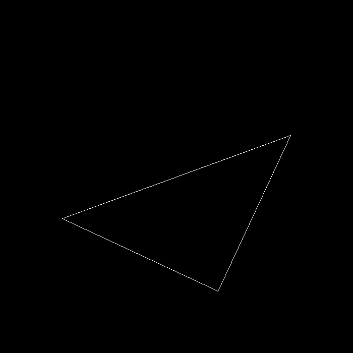
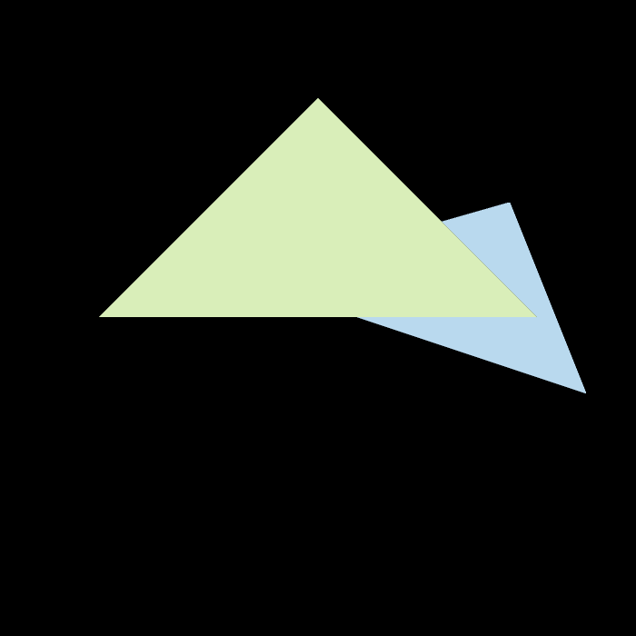
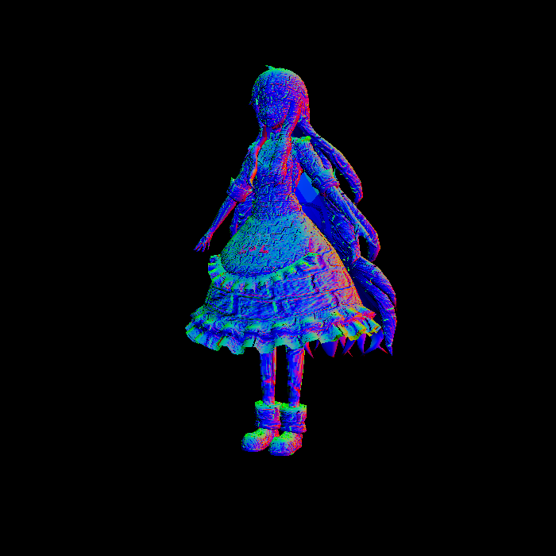
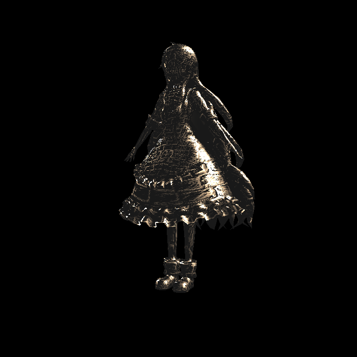
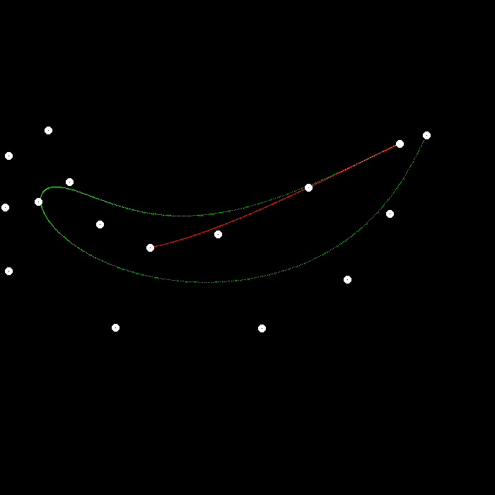
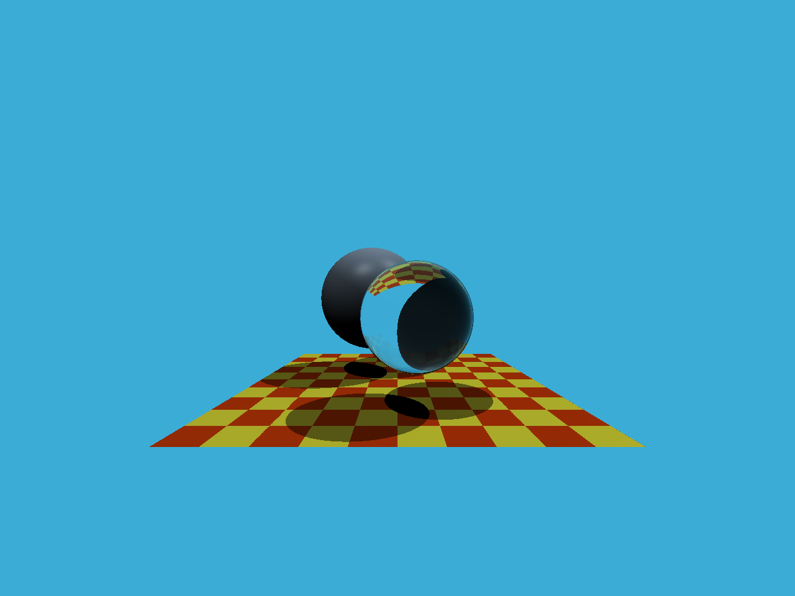
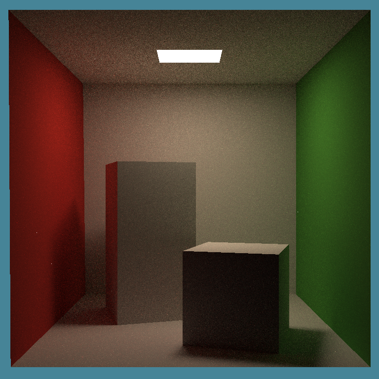

# games101_homework
闫老师games101课堂作业

| 截图 | 截图 | 截图 | 
| --- | - | --- | 
| 1.旋转与投影 | 进行模型、视图、投影、视口等变换来将三角形显示在屏幕上 |  | 
| 2.三角形绘制 | 三角形绘制、深度检测、重心坐标等知识点 |  | 
|  | 超采样、抗锯齿 |  | 
| 3.网格、顶点着色、片段着色 | 法线显示图 |  | 
|  | Blinn-phong |  | 
|  | 纹理采样 |  | 
|  | 凹凸贴图 |  | 
|  | 置换贴图（顶点偏移 |  | 
| 4.贝塞尔曲线 | 贝塞尔曲线生成原理 |  | 
| 5.光线与三角形相交 | 光线的构造，光线发射，光线与网格所有三角形相交检查 |  | 
| 6.光线检测加速 | BVH树的构建,光线对BVH树的检测 |  | 
| 7.光线 | 光源、光线反射、多线程采样，Diffuse着色 |  | 
| 8.物理 | 质点弹簧系统 |  | 
